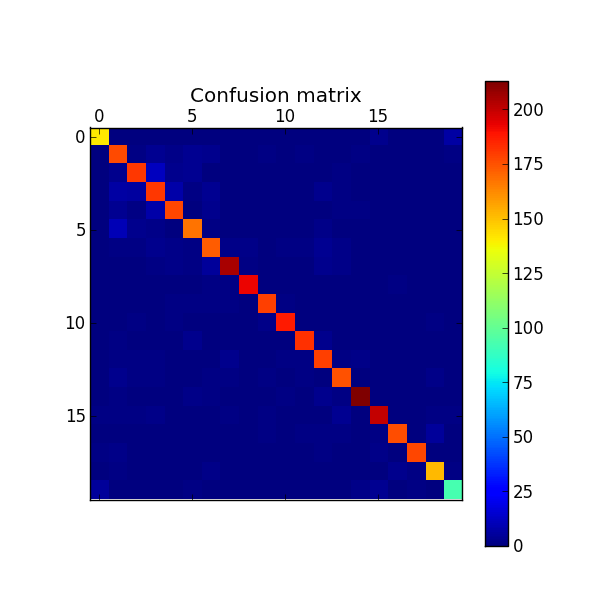

The 20 Newsgroups data set
==========================

Description
-----------------------
The 20 Newsgroups data set is a collection of approximately 20,000 newsgroup documents, partitioned (nearly) evenly across 20 different newsgroups. Originally collected by Ken Lang, this collection has become a popular data set for experiments in text applications of machine learning techniques, such as text classification and text clustering.
Since the dataset is quite big to run on a single machine I ran less tests here. Only Kmeans for clustering and SVM for the supervised classifier. 

	- alt.atheism
	- comp.graphics
	- comp.os.ms-windows.misc 
	- comp.sys.ibm.pc.hardware
	- comp.sys.mac.hardware
	- comp.windows.x
	- misc.forsale
	- rec.autos
	- rec.motorcycles
	- rec.sport.baseball
	- rec.sport.hockey
	- sci.crypt
	- sci.electronics
	- sci.med
	- sci.space
	- soc.religion.christian
	- talk.politics.guns
	- talk.politics.mideast
	- talk.politics.misc
	- talk.religion.misc

Classification  results
-----------------------

Running classification script for this dataset.

``python text_classification.py -D data/20newsgroup``::

	Loaded 18828 documents
	Loaded 20 categories
	Categories  ['alt.atheism', 'comp.graphics', 'comp.os.ms-windows.misc', 'comp.sys.ibm.pc.hardware', 'comp.sys.mac.hardware', 'comp.windows.x', 'misc.forsale', 'rec.autos', 'rec.motorcycles', 'rec.sport.baseball', 'rec.sport.hockey', 'sci.crypt', 'sci.electronics', 'sci.med', 'sci.space', 'soc.religion.christian', 'talk.politics.guns', 'talk.politics.mideast', 'talk.politics.misc', 'talk.religion.misc']

	Number of documents for training 15062
	Number of documents for testing 3765

Linear Model
**************************

``python text_classification.py -C linear_model -D "./data/20newsgroup"`` gives the following result::

	Fold 1 --------------------------------
	Performing classification with method  LINEAR_MODE

	**** Classification report ****
	                          precision    recall  f1-score   support

	             alt.atheism       0.95      0.93      0.94       151
	           comp.graphics       0.83      0.91      0.87       195
	 comp.os.ms-windows.misc       0.92      0.89      0.90       204
	comp.sys.ibm.pc.hardware       0.84      0.86      0.85       211
	   comp.sys.mac.hardware       0.90      0.91      0.91       196
	          comp.windows.x       0.90      0.90      0.90       186
	            misc.forsale       0.89      0.90      0.89       193
	               rec.autos       0.96      0.93      0.94       220
	         rec.motorcycles       0.98      0.98      0.98       196
	      rec.sport.baseball       0.97      0.97      0.97       184
	        rec.sport.hockey       0.98      0.97      0.98       193
	               sci.crypt       0.97      0.96      0.97       190
	         sci.electronics       0.90      0.94      0.92       190
	                 sci.med       0.93      0.94      0.93       186
	               sci.space       0.97      0.96      0.97       222
	  soc.religion.christian       0.95      0.94      0.95       213
	      talk.politics.guns       0.98      0.95      0.96       186
	   talk.politics.mideast       0.99      0.97      0.98       184
	      talk.politics.misc       0.94      0.95      0.95       160
	      talk.religion.misc       0.90      0.88      0.89       106

	             avg / total       0.93      0.93      0.93      3766

	--------- Final results for Cross Validation ---------
	Avg Accuracy 0.932819968136
	Avg Precision 0.933681746577
	Avg Recall 0.932819968136
	Avg F1 0.933077877902

Cross-Validation
################
Results performing 5 k-Fold Cross Validation.

``python text_classification.py -C linear_model -D data/20newsgroup -N 5`` gives the following result::

Evaluation scores::

	Avg Accuracy 0.934944237918
	Avg Precision 0.935938167675
	Avg Recall 0.934944237918
	Avg F1 0.935168029874

Conclusions
-----------------------
A lot of tests were performed at the reduced version of this dataset. The nature of the documents are the same and we can see that with no change at the code it performs fine with a bigger dataset. But of course, there is always room for improvements. For example run tests with Support Vector Machine algorithm. This was not performed yet for lack of dedicated hardware. I hope to provide it soon.
For this reason I used linear model since it is a bit faster compared to SVM and Naive Bayes. The performance may not be optimal but is faster.
Having said that, compare the results between these three algorithms with this dataset is a future work.
Another future experiment would be implement a classifier for each category and compare the results.