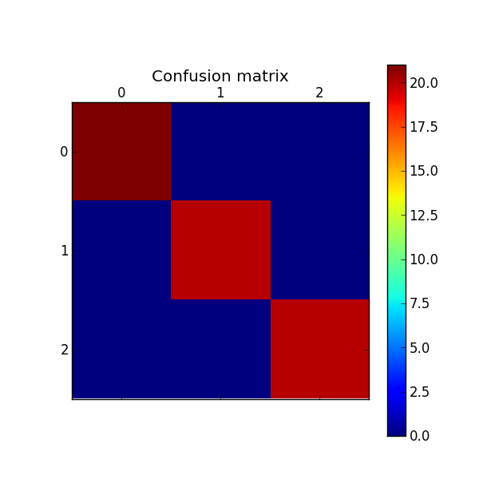
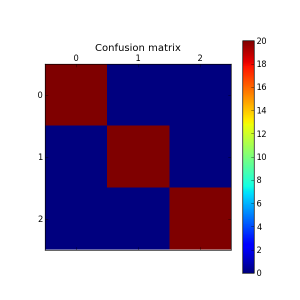

The 20 Newsgroups data set (reduced version)
============================================

Description
-----------------------
Reduced version for the 20 Newsgroups data set, by Ken Lang. This version a collection of 300 newsgroup documents, partitioned across 3 different newsgroups, each one with 100 samples.

	- comp.os.ms-windows.misc 
	- comp.sys.mac.hardware
	- sci.med
	
Classification results
-----------------------

Since this dataset is relatively small I performed several experiments here.
For this dataset in particular this section will be divided by classifier algorithm and the evaluation results will be performed with simple random subsampling and another Cross Validation with more iterations.

Cross-Validation
**************************
Running a classifier without Cross Validation can give you misleading results. The best practice is to run tests several times with different set samples for training and test, computing the average scores.
Although this is the best practice, this is not always possible for several reasons. Sometimes the dataset is to big or you don't have enought hardware to compute the results in reasonable time. 
By default the script evaluate results using a single iteration ploting an image with the confusion metrics. To use Cross-Validation with N iterations you need to specify the parameter -N.

``text_classification.py --help`` gives useful output::

	Options:
	  -N N_ITERATIONS, --cv_n_iterations=N_ITERATIONS
	                        Number of interations for Cross Validation

More info about Cross-Validation can be found `here <http://research.cs.tamu.edu/prism/lectures/iss/iss_l13.pdf>`_

Finding the best parameters
****************************

I tried to use as default values for each vectoryzation and classifiers parameter using the script :doc:`find_best_classifier.py </source_doc>`. It runs as follows:
All defined parameters will be combined, tested and evaluated to find the classifier with the best scores.

Usage example to find the best parameters for SVM and the 20newsgroup_small dataset:

``python find_best_classifier.py -D data/20newsgroup_small -C svm`` ::

	Performing grid search...
	pipeline: ['vect', 'tfidf', 'clf_svm']
	parameters:
	{'clf_svm__C': (1.0, 2.0),
	 'tfidf__use_idf': (True, False),
	 'vect__max_df': (0.5, 0.75, 1.0),
	 'vect__max_features': (None, 5000, 10000, 50000),
	 'vect__ngram_range': ((1, 2), (1, 5))}
	[Parallel(n_jobs=-1)]: Done   1 jobs       | elapsed:    2.5s
	[Parallel(n_jobs=-1)]: Done  50 jobs       | elapsed:   50.8s
	[Parallel(n_jobs=-1)]: Done 200 jobs       | elapsed:  3.3min
	[Parallel(n_jobs=-1)]: Done 282 out of 288 | elapsed:  4.6min remaining:    5.9s
	[Parallel(n_jobs=-1)]: Done 288 out of 288 | elapsed:  4.7min finished
	done in 285.981s

	Best score: 1.000
	Best parameters set:
		clf_svm__C: 2.0
		tfidf__use_idf: False
		vect__max_df: 1.0
		vect__max_features: 5000
		vect__ngram_range: (1, 5)

Loading dataset
**************************

Running classification script for this dataset.
``python text_classification.py -D data/20newsgroup_small``::

	Loaded 300 documents
	Loaded 3 categories
	Categories  ['comp.os.ms-windows.misc', 'comp.sys.mac.hardware', 'sci.med']

	Number of documents for training 240.0
	Number of documents for testing 60.0

Results
---------
For each classifier algorithm I present here the results.  

Support Vector Machines
************************** 

``python text_classification.py -C svm -D data/20newsgroup_small`` gives the following result for single random sampling::

	Performing classification with method  SVM

	**** Classification report ****
	                         precision    recall  f1-score   support

	comp.os.ms-windows.misc       1.00      1.00      1.00        21
	  comp.sys.mac.hardware       1.00      1.00      1.00        20
	                sci.med       1.00      1.00      1.00        20

	            avg / total       1.00      1.00      1.00        61

	**** Confusion matrix ****
	[[21  0  0]
	 [ 0 20  0]
	 [ 0  0 20]]

	--------- Final results for Cross Validation ---------
	Avg Accuracy 1.0
	Avg Precision 1.0
	Avg Recall 1.0
	Avg F1 1.0

.. image:: _plots/20newsgroup_small/svm_results.png

Cross-Validation
################
Results performing 30 k-Fold Cross Validation.

``python text_classification.py -C svm -D data/20newsgroup_small -N 30`` gives the following result::
	
Evaluation scores::

	Avg Accuracy 0.998360655738
	Avg Precision 0.998439611127
	Avg Recall 0.998360655738
	Avg F1 0.998362082938

Linear model
**************************

``python text_classification.py -C linear_model -D data/20newsgroup_small`` gives the following result::

	Performing classification with method  LINEAR_MODEL

	**** Classification report ****
	                         precision    recall  f1-score   support

	comp.os.ms-windows.misc       1.00      1.00      1.00        21
	  comp.sys.mac.hardware       1.00      1.00      1.00        20
	                sci.med       1.00      1.00      1.00        20

	            avg / total       1.00      1.00      1.00        61

	**** Confusion matrix ****
	[[21  0  0]
	 [ 0 20  0]
	 [ 0  0 20]]

	--------- Final results for Cross Validation ---------
	Avg Accuracy 1.0
	Avg Precision 1.0
	Avg Recall 1.0
	Avg F1 1.0

Cross-Validation
################
Results performing 30 k-Fold Cross Validation.

``python text_classification.py -C linear_model -D data/20newsgroup_small -N 30`` gives the following result::
	
Evaluation scores::

	Avg Accuracy 0.995628415301
	Avg Precision 0.995835285276
	Avg Recall 0.995628415301
	Avg F1 0.995609921353

Naive Bayes
**************************

``python text_classification.py -C naive_bayes -D data/20newsgroup_small`` gives the following result::

	Fold 1 --------------------------------
	Performing classification with method  NAIVE_BAYES

	**** Classification report ****
	                         precision    recall  f1-score   support

	comp.os.ms-windows.misc       1.00      1.00      1.00        20
	  comp.sys.mac.hardware       1.00      1.00      1.00        20
	                sci.med       1.00      1.00      1.00        20

	            avg / total       1.00      1.00      1.00        60

	**** Confusion matrix ****
	[[20  0  0]
	 [ 0 20  0]
	 [ 0  0 20]]

	--------- Final results validation ---------
	Avg Accuracy 1.0
	Avg Precision 1.0
	Avg Recall 1.0
	Avg F1 1.0.0
	Avg F1 1.0

Cross-Validation
################
Results performing 30 k-Fold Cross Validation.

``python text_classification.py -C naive_bayes -D data/20newsgroup_small -N 30`` gives the following result::

Evaluation scores::

	Avg Accuracy 0.996174863388
	Avg Precision 0.996440740353
	Avg Recall 0.996174863388
	Avg F1 0.996192963227

Conclusions
-----------------------
All classifiers performed quite similar with scores reaching the top. To get these results each one was tuned testing different combinations of parameters.
Another reason for good reasults is that the samples are well balanced. With balanced I mean we have the same number of samples for each class.
In general, most of classifiers assume that categories are balanced, which is clearly the case here, 100 samples for each of the three classes.

Also, important to note, remember that not only the classifiers parameters need to be tuned. Feature selection phase is really important and considering Text Mining problems, good features comes from a good vector of terms.
To build a vectors an important option that needs especial attention is the ngrams range. Here at the feature extraction phase we build vector for uni-grams, bi-grams, three-grams, 4-grams and 5-grams. This action increase substantialy the performance for all the tested classifiers.

.. code-block:: python 

	vectorizer = CountVectorizer( 	max_df=1.0, 
	                        	max_features=5000, 
	                          	ngram_range=(1, 5),
	                          	charset_error='ignore',
	                          	# stop_words='english',
	                          	lowercase=True,
	                          	strip_accents="unicode"
	                          	)

	text_clf = Pipeline([('vect', vectorizer),
	                ('tfidf', TfidfTransformer(use_idf=False)),
	                ('clf', SVC(C=2.0,kernel='linear')), ])

Interesting to note here is that vectorizing with Tf-Idf transformation using IDF and getting rid of common words between documents decreased scores.

