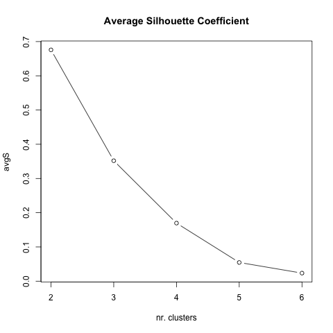
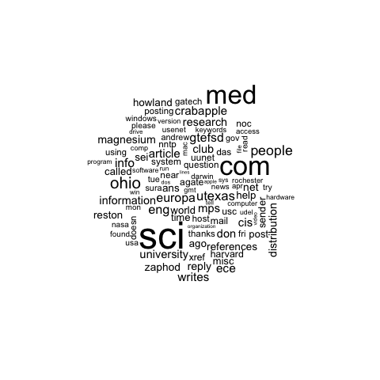

The 20 Newsgroups data set (reduced version)
============================================

Description
-----------------------
Reduced version for the 20 Newsgroups data set, by Ken Lang. This version a collection of 300 newsgroup documents, partitioned across 3 different newsgroups, each one with 100 samples.

	- comp.os.ms-windows.misc 
	- comp.sys.mac.hardware
	- sci.med
	
Clustering results
-----------------------

KMeans
**************************
``python text_clustering.py -C kmeans -D data/20newsgroup_small -F 10`` gives the following result::

	Homogeneity: 0.982978
	Completeness: 0.983008
	V-measure: 0.982993
	Adjusted Rand-Index: 0.989983
	Silhouette Coefficient: 0.657498

``python text_clustering.py -C kmeans -D data/20newsgroup_small -F 5`` gives the following result::

	Homogeneity: 1.000
	Completeness: 1.000
	V-measure: 1.000
	Adjusted Rand-Index: 1.000
	Silhouette Coefficient: 0.873

With kMeans we achieve good results setting the number max of features to 10 and even better with 5. With good results with a number of features so low it claims for closer look. I hope to present it soon.

Find number of clusters based on silhouette coeficient
#######################################################

If you run R script it perform clustring with KMeans with diferent values for `K` and compare the results for the silhouette coeficient. As parameters you inform the dataset path, if you want TF-IDF weighting and the number of `K` values to test.
In this case, dataset 20newsgroup_small, not weighting with TF-IDF and testing clustering up until 6 clusters.

``R -f find_k_clusters.r ../../data/20newsgroup_small FALSE 6``

According to this analysis it says that this dataset is made of 2 groups of documents. We know that in fact there are 3 groups, but looking closely 2 of them are computer related, which can be the reason these 2 may be too similar.

NOTE: Results are different from those I found above with the Python script. It is mainly because the feature extraction are different. I still need to work on it and perform the same feature extraction in R as I did in Python. 

Text sumarization with world clouds
###################################

Wordclouds are good to summarize documents. It is great to visually highlight the most representative words for each cluster. 
This script in R perform clustering and as output plots wordclouds for each cluster.
As mentioned above, the algorithm tells that it may be a good idea to consider only 2 groups. To present more latent results I will consider here 2 clusters instead of 3. 

An example of use with `20newsgroup_small` dataset::

	R -f build_worldclouds.r ../../data/20newsgroup_small/ FALSE 2 30 80

Here the plotted for each of the two clusters.

