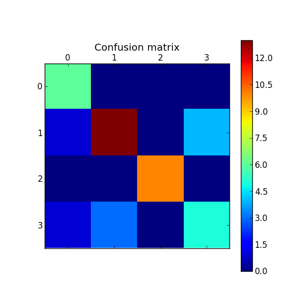

Wikipedia data set
==================

Description
-----------------------
The Wikipedia data set is a collection of approximately 80 documents, representing each one an entry on wikipedia.
These entries are partitioned into 4 topics and each topic has approximately 50 entries. Each entry is an crawled HTML file.

	- automotive
	- banking
	- music
	- universities

Classification  results
-----------------------
Running classification script with default parameters.

``python text_classification.py -D data/wikipedia``::

	Loaded 213 documents
	Loaded 4 categories
	Categories  ['automotive', 'banking', 'music', 'universities']

	Number of documents for training 170
	Number of documents for testing 42

Support Vector Machines
**************************

``python text_classification.py -C svm -D data/wikipedia`` gives the following result::

	Fold 1 --------------------------------
	Performing classification with method  SVM

	**** Classification report ****
	              precision    recall  f1-score   support

	  automotive       0.75      1.00      0.86         6
	     banking       0.81      0.72      0.76        18
	       music       1.00      1.00      1.00        10
	universities       0.56      0.56      0.56         9

	 avg / total       0.79      0.79      0.79        43

	**** Confusion matrix ****
	[[ 6  0  0  0]
	 [ 1 13  0  4]
	 [ 0  0 10  0]
	 [ 1  3  0  5]]

	--------- Final results for Validation ---------
	Avg Accuracy 0.790697674419
	Avg Precision 0.793604651163
	Avg Recall 0.790697674419
	Avg F1 0.78854797733

Cross-Validation
################

Evaluate results performing 5 k-Fold Cross Validation:

``python text_classification.py -C svm -D data/wikipedia -N 5`` gives the following result::

	Avg Accuracy 0.855813953488
	Avg Precision 0.871960066837
	Avg Recall 0.855813953488
	Avg F1 0.85822153017

Conclusions
-----------------------
The result seams promissing, but there is a lot to improve. The documents are entries from Wikipedia and its HTML and Wikis markups weren't cleaned. One hypothesis is that it can be considered noise and make classifiers perform worse.
Especial attention could be payed for university category, which present the worst performance. An alternative here could be ask for more samples or train separated classifiers for each category.
The next step here is to run :doc:`find_best_classifier.py </source_doc>` to find the optimal parameters for this dataset.
