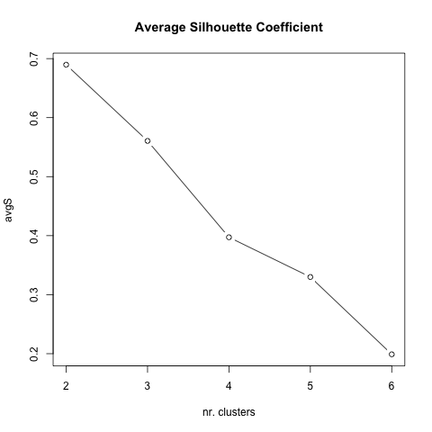
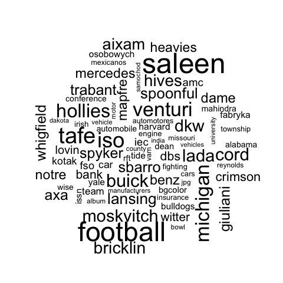
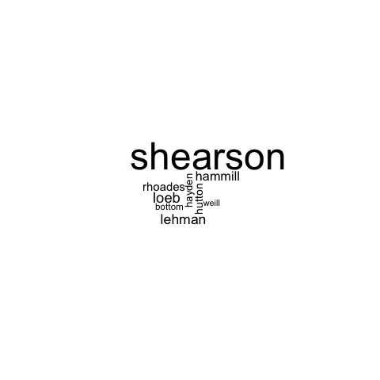
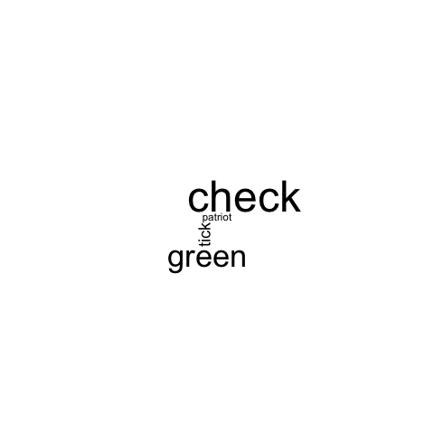

The Wikipedia data set
======================

Description
-----------------------
The Wikipedia data set is a collection of approximately 80 documents, representing each one an entry on wikipedia.
These entries are partitioned into 4 topics and each topic has approximately 50 entries. Each entry is an crawled HTML file.

	- automotive
	- banking
	- music
	- universities

Clustering results
-----------------------

KMeans
**************************
``python text_clustering.py -C kmeans -D data/wikipedia -F 100`` gives the following result::

	Homogeneity: 0.736741
	Completeness: 0.755071
	V-measure: 0.745793
	Adjusted Rand-Index: 0.653573
	Silhouette Coefficient: 0.194805

Hierachical clustering
**********************
``python text_clustering.py -C hclust -D data/wikipedia -F 100`` gives the following result::

	Homogeneity: 0.701387
	Completeness: 0.723358
	V-measure: 0.712203
	Adjusted Rand-Index: 0.609868
	Silhouette Coefficient: 0.187303

Here the results are much worse compared to the 20 newsgroup datasets. Further analysis and tunning should be done here. 
Special attention should be give to the Silhouette Coefficient. The best value is 1 and the worst value is -1. Values near 0 indicate overlapping clusters. Negative values generally indicate that a sample has been assigned to the wrong cluster, as a different cluster is more similar.
In this example we see that a lot of documents are in more than one cluster.
The results here are not impressive. Further analysis and tuning should be done for this dataset.

Find number of clusters based on silhouette coeficient
#######################################################

If you run R script it perform clustring with KMeans with diferent values for `K` and compare the results for the silhouette coeficient. As parameters you inform the dataset path, if you want TF-IDF weighting and the number of `K` values to test.
Tests will be run with up until 6 clusters.

``R -f find_k_clusters.r ../../data/wikipedia FALSE 6``

According to this analysis it says that this dataset is made of 2 groups of documents. We know that in fact there are 4 groups, I'm still not sure will so much difference.

NOTE: Results are different from those I found above with the Python script. It is mainly because the feature extraction are different. I still need to work on it and perform the same feature extraction in R as I did in Python. 

Text sumarization with world clouds
###################################

Wordclouds are good to summarize documents. It is great to visually highlight the most representative words for each cluster. 
This script in R perform clustering and as output plots wordclouds for each cluster.

An example of use with `wikipedia` dataset::

	R -f build_worldclouds.r ../../data/wikipedia/ FALSE 4 30 80

Here the plotted for each of the four clusters. Its a start. I'm sure it can be improved.

.. image:: _plots/wikipedia/1_wikipedia.png

